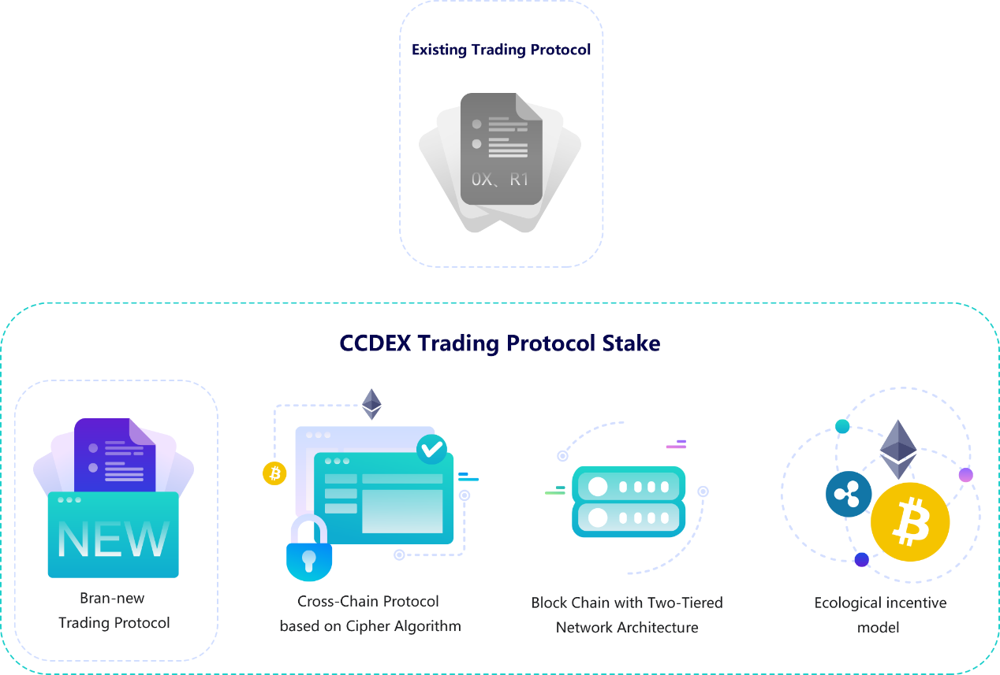
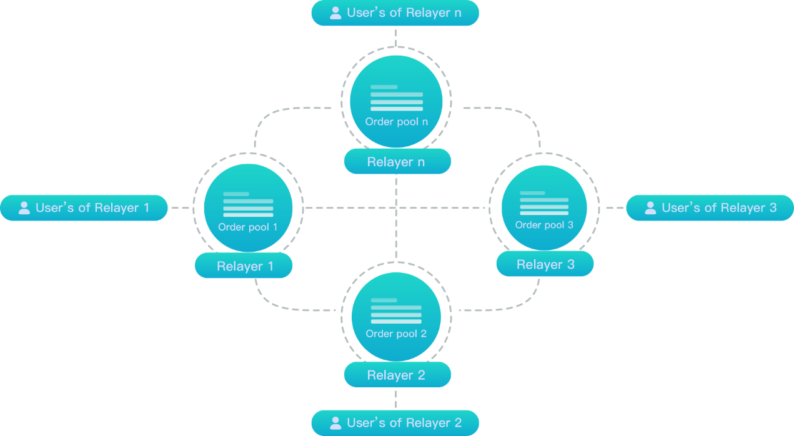
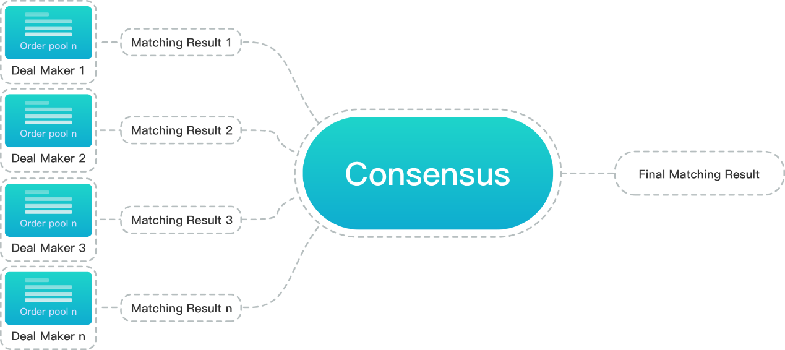
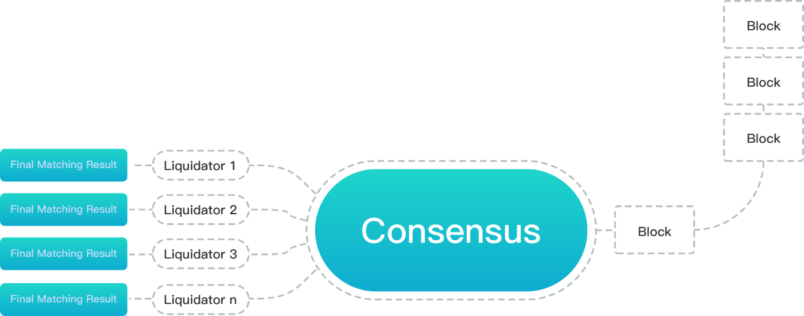
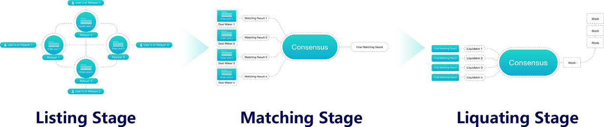
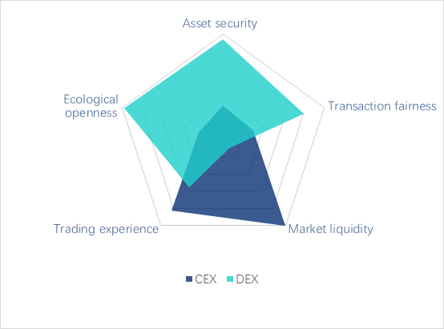
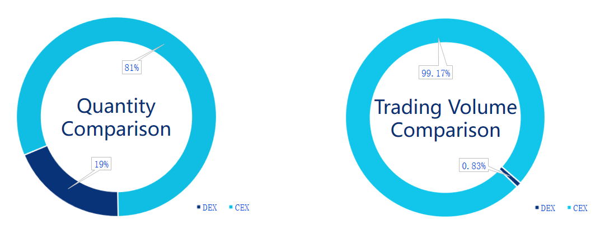
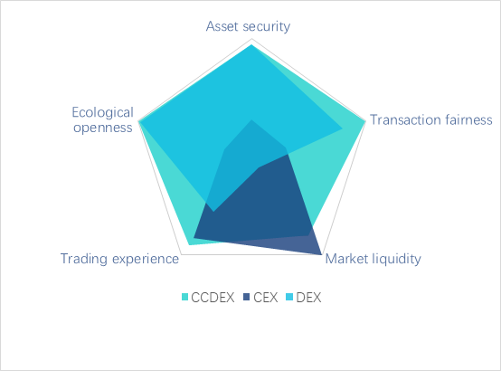

# Introduction to Business Logic of CCDEX #

##### *V 1.0* #####

A cross-chain decentralized exchange (DEX) ecology based on CCDEX (Cross-Chain Decentralized Exchange) exchange protocol stack, it has made a great breakthrough and innovation in terms of exchange mechanism, profit distribution and incentives, and open ecological construction comparing to the traditional DEX. The trans-regional and cross-exchange of crypto-asset realized by CCDEX is the cornerstone and guarantee for value free flow in a worldwide range.

# 1. Overview of CCDEX #

## 1.1. CCDEX - A New Eco-solution for Exchanges ##

First of all, CCDEX is an upgrade of the existing DEX exchange protocol. The previous decentralized protocols, such as 0x, R1, only solve the order matching problem of single value ecology, but without the consideration of the demand to DEX in transaction settlement and cross-chain. CCDEX has realized the cross-chain protocol based on crypto-graphic algorithm, which enables DEX built on the cross-chain protocol of CCDEX to support more cross-chain asset exchanges for the first time.

Secondly, CCDEX is a set of efficient exchange matching and clearing protocol which conforms to the characteristics of block chain system. CCDEX system is deployed on the block chain architecture of innovative Tier-2 network, which provides the exchange system with better business scalability and flexibility, as well as higher matching efficiency and settlement speed.

Thirdly, CCDEX is a complete set of new cross-chain decentralized exchange protocol stack solution. Based on the protocol stack, users can easily build a new generation of DEX supporting the cross-chain operation of crypto-asset with high performance.

###### .　　　　　　　　　　　　　　　　　　　　　　　　　　　　　　
*Figure* *1*

Finally, CCDEX is a new Eco-solution for exchanges. CCDEX is designed with an allocation principle of transaction fees to promote exchange order sharing, which encourages all nodes in the Ecosystem in order sharing, and realizes ecological co-construction.

## 1.2. Value and Vision of CCDEX ##

Based on inheriting the advantages of DEX, CCDEX has achieved a series of technological breakthroughs, which makes it reaching to the centralized exchange (CEX) or even surpassing it in all indicators.

-   CCDEX introduces more currency pairs of mainstream crypto-asset into DEX through cross-chain technology, which greatly improves the transaction depth and market liquidity of DEX.

-   CCDEX uses a scalable block chain architecture and a brand new transaction matching mechanism, which makes DEX faster in transaction matching and clearing speed, it supports greater transaction throughput and realizes a faster price discovery.

-   The new matching algorithm of CCDEX fundamentally eliminates front-running and further improves the fairness of transactions.

-   The order sharing mechanism between exchanges constructed by CCDEX has fundamentally improved the situation of insufficient liquidity of DEX.

The DEX built on CCDEX is leading in all existing DEX in terms of functions and performance based on the above breakthroughs, and it can be a rival to CEX in performance which makes DEX built on CCDEX with the potential to replace the market share of CEX.

The platform of cross-chain decentralized exchange constructed by CCDEX protocol stack is dedicated to realize the free flow of global value in block chain mode among all crypto-assets.

# 2. Transaction Process and Characteristics of CCDEX #

## 2.1. Definition of Transaction Business Roles ##

CCDEX defines the following business roles.

| Roles | Corresponding in the System | Operations |
| :-------- | :----- | :---- |
| Order Creator | Exchange Users | Sending buy or sell orders to DEX. |
| Relayer | Pending Order Node in Tier-2 Network | Receiving orders. Updating the order pool after verification and sharing the order with other matching nodes. |
| Deal Maker | Matching Node of Tier-2 Network | Matching orders in the order book based on the matching rules and eventually generating matching results. |
| Liquidator | Accounting Node in the Underlying Public Block-chain | Receiving and executing the matching result instructions. Completing the change of the state value of the trader according to the result of order matching. |

## 2.2. Process of Transaction ##

The transaction in CCDEX is divided into the following process.

### 2.2.1. Pending Order ###

Pending order refers to the process from an order issued by a user till it\'s updated to the order pool by the Relayer, and then it will be shared to the Relayer nodes of other exchanges throughout the network and waiting for matching. This phase is accomplished by Order Creator and Relayer on the Tier-2 network.

###### .　　　　　　　　　　　　　　　　　　　　　　　　　　　　　　
*Figure* *2*

In the process of pending order, users must apply for orders from their own exchange, which guarantees the binding relationship between the exchange and its developing users. Orders are also shared with the unique identity of the users' exchanges.

The order is shared to the Relayer nodes of other exchanges, which gives the order a chance to match up with orders of other exchanges. When order matching is completed, the pending order reward from transaction fee will be allocated to the order corresponding exchange according to its identity.

### 2.2.2. Matching ###

Matching refers to the process of obtaining tradable orders from the order pool periodically through the matching node and completing the order matching according to the call auction rules. This process is accomplished by Deal Maker in the Tier-2 network.

###### .　　　　　　　　　　　　　　　　　　　　　　　　　　　　　　
*Figure* *3*

In the process of matching, each matching node forms its own matching result. Based on the principle of maximum transaction volume, the system selects the optimal matching result from each matching node as the final matching result of this round through competition. Nodes that are successfully merged and adopted by the system will be rewarded through transaction fees.

In addition to Deal Maker nodes deployed by exchanges, CCDEX supports independent third parties in building Deal Maker nodes to provide matching services for users and receive rewards.

### 2.2.3. Liquidation ###

Liquidation means that according to the final matching result, the accounting node completes the change of the status value of each transaction party, and records all transactions into blocks in the block chain to become historical transaction data which is open, permanent and traceable. And Liquidator is the accounting node on the underlying network.

###### .　　　　　　　　　　　　　　　　　　　　　　　　　　　　　　
*Figure* *4*

## 2.3. Characteristics of Transactions ##

###### .　　　　　　　　　　　　　　　　　　　　　　　　　　　　　　
*Figure* *5*

The design of CCDEX transaction embodies better scalability and expansibility, which are:

> (1) Loose coupling and asynchronous parallelism among the three business links not only guarantee a greater processing capacity of each link, but also ensure less interference to the business process. Even if there is a large concurrent volume in one link, it will not be easily transferred to the others.

> (2) The loose coupling business logic is able to realize a better expansion of each link. For example, the hardware of the Relayer node can be expanded to enhance the service capability and availability of the pending order node, and the concurrent polling of different exchanges can be matched if necessary in order to double the matching performance and transaction capacity.

> (3) The separation of matching and liquidation is accorded with the design criteria of financial accounting business, which significantly improves the business security.

# 3. Ecological Governance of CCDEX #

## 3.1. Open Ecological Governance ##

### 3.1.1. Community-based Governance ###

CCDEX is a decentralized platform-level system, and community governance is an important part of the ecological construction of CCDEX.

Openness must be ensured for CCDEX community governance. The design of community mechanism ensures that users who agree with the concept of community development can participate in community construction, and it also ensures the right of project stakeholders to express their opinions and vote in decision-making for community affairs.

The contents of community governance include setting business parameters (such as rates), revising business rules (such as new currency on-line, new currency pair support, etc.), community publicity and promotion, and community construction mechanism.

### 3.1.2. Platform Pass is a Lubricant for Community Governance ###

Platform pass is the carrier of Eco-community governance of exchanges, it is the voucher of users participating in community governance of exchanges and the medium of voting.

In the business Ecosystem of CCDEX, new assets and currency pairs on-line require platform passes. Transaction fees and settlement costs also require platform passes. Users are registered as pending order nodes or matching nodes, and they need to mortgage a certain number of platform passes to enjoy the value-added services of CCDEX. The development of other new businesses also need to be carried out by
platform pass.

Users can obtain platform passes by means of exchange, mining, mortgage and participation in community activities.

## 3.2. Upstream and Downstream Cooperation on Industrial Chain ##

### 3.2.1. Other Block Chain Projects ###

For issuing crypto-assets and block chain projects with asset trading demands, you can choose to trade related assets on the exchanges of CCDEX, or you can use the CCDEX transaction protocol stack to build your own exchange to serve the value exchange within your Ecosystem.

For block chain applications with cross-chain demands, you can develop and deploy your own business applications under the framework of CCDEX protocol, so that it can be supported by the cross-chain protocol of CCDEX.

### 3.2.2. Existing Wallet Projects ###

Wallet is a bridge between users and crypto-assets, and it is an important part of the ecology of exchanges. With the development of the industry, the homogeneity of wallets become more and more serious.

CCDEX is able to bring more functions to wallets. The introduction of wallets to the CCDEX ecology is not only beneficial to the development of wallets itself, but also conducive to the development of CCDEX.

-   The wallets are able to realize a secure and unified management for multiple assets based on the cross-chain technology of CCDEX.

-   The wallets are able to participate in the ecological construction of CCDEX through the deployment of Relayer nodes. CCDEX is able to provide multi-currency transaction functions for wallets, which greatly enriches the functions of wallets.

-   Wallets with market expansion capabilities can also use CCDEX to build their own exchanges to further enhance customer viscosity. Wallets with cross-chain transaction function can better attract users and convert user resources into revenue through transaction behavior.

-   CCDEX can also rapidly develop wallets into exchanges, which jointly exploit markets and acquire users, and promote the common growth of CCDEX ecology and wallets. 

### 3.2.3. Development Team of Crypto-assets ###

CCDEX is able to cooperate with various crypto-asset development teams to develop and research derivatives and provide users with more abundant derivative services. Including futures, options, indices, market makers, quantitative trading, asset management and financial management, crypto-assets lending and risk control, etc. These products and services can greatly enrich the business Ecosystem of CCDEX, and they are also the competitive objects for various crypto-assets development teams.

### 3.2.4. Existing Exchanges ###

CCDEX ecology does not have a competitive relationship with existing exchanges. While maintaining their independence, they can achieve maximum inclusiveness at the business level, whether they are the existing CEX or DEX, and whether they are head exchanges or small exchanges.

Higher liquidity is crucial for exchanges to enhance their attractiveness and gain more benefits. On the basis of guaranteeing the exchange\'s own flow and revenue, the order sharing mechanism of CCDEX achieves an incremental benefit for all transaction participants, and it can attract more exchanges to join the Ecosystem of CCDEX.

### 3.2.5. Capital and Project Parties Planning to Participate in Crypto-asset Transaction ###

CCDEX simplifies the technical threshold for capital and project parties to participate, which allowing them to concentrate on innovation in their areas of expertise.

-   Project parties with user resources and willingness to enter the transaction market can build distributed cross-chain exchanges on the ecology of CCDEX.

-   Capitalists can also find investment targets, and carry out lending business or hold platform passes within CCDEX Ecosystem.

-   CCDEX provides necessary resources, such as mobility and users, to facilitate the project in quickly building their own applications.

A good application not only brings benefits to project and capital, but also enriches the CCDEX Ecosystem and enhances the attraction from CCDEX.

### 3.2.6. Exchange Users ###

The cooperation between CCDEX and other resources will enable users in the CCDEX Ecosystem to get a better experience of crypto-asset trading.

-   Users of CCDEX can have a unified management of crypto-assets in different block chains when they are able to control assets independently.

-   Users can participate in all kinds of transactions and financial services in the CCDEX Ecosystem at any time without frequent transfers between wallets and exchange accounts, thus saving the time and reducing unnecessary losses.

-   CCDEX Ecosystem is rich in business applications, users can enjoy a variety of different types of applications and services with one-stop experience, thus playing a more valuable role in addition to crypto-asset transactions.

-   In the business Ecosystem of CCDEX, users can choose different exchanges to carry out personalized business according to their preferences and business needs. They can also share liquidity with CCDEX and all other exchanges and users, which will bring users a new transaction experience.

## 3.3. Income Source of CCDEX ##

The current income of CCDEX is mainly transaction fee. Transaction fees originate from completed orders, and different parties obtain a certain proportion of the transaction amount as their business income according to their contribution and role in the transactions.

CCDEX supports most of the mainstream crypto-assets including BTC and ETH through cross-chain technology. The transaction fees obtained by CCDEX will also consist of these mainstream crypto-assets. Compared with the exchange platform currency settlement or the underlying block chain platform currency settlement, the transaction fee income of CCDEX has a more stable price performance.

## 3.4. Incentive Design and Effect ##

### 3.4.1. Design Purpose ###

Each service provider receives reasonable returns according to the corresponding contributions, each role is mutually beneficial, the system is benign and sustainable for development, and users are guaranteed with good service and transaction experience.

### 3.4.2. Incentive Rules ###

According to the principle of "getting pay for work done and get more for more done". Transaction fees and transaction liquidation fees are calculated separately, and business incentives will only be allocated to participants in the business.

### 3.4.3. Incentive Mechanism for Order Sharing Based on Pareto Optimality ###

The incentive mechanism for order sharing based on Pareto Optimality is a set of rules designed comprehensively, which includes transaction fee allocation rules, competition screening of matching nodes based on matching results, and positive guidance of order sharing behavior of different roles through economic incentives.

> **(1) Distribution Rules of Transaction Fees**

The transaction fee is allocated as an incentive to the corresponding incentive target as a reward to their contribution in the transaction process. Relayer, Deal Maker and the platform, which provide support and services for transaction completion, will share transaction fees. The specific ways of allocation are as follows:

| Objects | Distribution |
| :-------- | :----- |
| Relayer | When an order shared by the Relayer is concluded, the transaction fee of the order is mostly obtained by the Relayer. |
| Deal Maker | Based on the competition rules of matching result, the winner of the matching node will get a part of the transaction fee. |
| Platform | A small portion of the transaction fee is used for the sustainable development of the platform, including but not limited to technology, commerce and promotion. |

> **(2) Competition Mechanism of Matching Nodes**

Among the different matching nodes, the principle of maximizing the volume of transactions is primary to compete, and the matching result of the winning node is written into the block as the final matching result. The specific process of the mechanism is as follows:

-   The orders in the matching node order pool can come from the pending orders issued by users from their own exchanges, including the order sharing from other exchanges;

-   All matching nodes have the right to produce their own matching results distributed according to their own order pool;

-   Based on the competition principle, all matching nodes will produce the final and only matching result;

-   The order in the final matching result will be closed and handed over to Liquidator for liquidation, while the order not included in the matching result cannot be closed.

> **(3) Guidance of Order Sharing Behavior**

The transaction fee of an order is mostly attributed to the exchange where the order is placed, which is the intrinsic factor for the exchange to seek more orders through order sharing.

DEX was mostly designed for order sharing in the past, but there is no phenomenon of order sharing so far. Small exchanges are willing to promote the transaction of user orders through swap liquidity, but large exchanges do not want to share liquidity which hinders the development of other exchanges.

Suppose that one of the largest exchanges does not share orders with anyone, while other exchanges construct a pool of shared orders through order sharing. And under the rule of CCDEX, as long as the volume of trade-able orders in the shared order pool is larger than that of the largest exchange itself, the matching result generated by the shared order pool will win the selection of nodes and become the final matching result.

Since transaction fees are paid only when transactions are completed, all exchanges sharing orders will receive transaction fee incentives, and their users will complete transactions smoothly. And the largest exchange, since it failed to win the matchmaking competition in this round of nodes, could not get any transaction fee and its user orders would not be completed. If this situation continues, the orders from users of the exchange will never be completed, and the users will eventually leave the exchange because of their poor transaction experience.

### 3.4.4. Rewards to Different Roles ###

> **(1) Reward to Relayer**

Relayer is an important link in the ecological chain of CCDEX.

Whether the individual Relayers, or the Relayers developed from wallets, or Relayers included in the third party exchange itself. The incentives to the Relayers are not only the incentives to themselves but also to their small Ecosystems. The transaction fee of the order is mostly rewarded to the Relayers, which fundamentally guarantees the main benefits of the Relayers and their small Ecosystems, and also ensures that the Relayers and their small Ecosystems do not lose users in the process of order sharing.

Only the interests of Relayers and their small Ecosystems are safeguarded, so that Relayers and their small Ecosystems can be encouraged to innovate constantly in business model and service content, which will constantly expand the market, improve service quality, and form personalized and differentiated services. Eventually it will better serve and develop more users.

> **(2) Reward to Order Matchmaker**

The order matchmaker is another important link in the ecological chain of CCDEX.

In addition to deploying its own matching nodes, CCDEX will also be open to third-party independent matching nodes, which gives some resource providers who do not want to build and operate exchanges, such as hashing power, storage and other institutions, the opportunity to participate in providing services and obtain transaction fees.

### 3.4.5. Incentive Effect ###

> **(1) Promoting Market Liquidity**

The incentive of CCDEX to order sharing will have a positive effect on liquidity, thus supporting the upper level in building a richer business form.

A larger unified transaction market will be built through order sharing. Most orders that could not be traded due to the limitation of transaction breadth and depth will be traded in the Ecosystem of CCDEX. This result will certainly enhance the liquidity of the market, thus forming positive feedback, attracting more users and partners to join the CCDEX Ecosystem, while encouraging more exchanges to share more orders.

> **(2) Building Foundation for A Richer Derivative Market**

The agglomeration of liquidity will be conducive to the establishment of a larger market in the field of crypto-asset transactions, and thus forming a more stable and representative price of crypto-assets, or even establishing a unified global price system in the future.

Larger and fairer markets with more stable and representative prices are conducive to the construction and support of various types of financial derivatives based on crypto-assets, such as futures markets, lending markets and quantitative transactions.

> **(3) Promoting the CCDEX Vision**

The incentive mechanism will effectively promote order and flow sharing between exchanges, it will substantially promote the construction of ecological alliance of exchanges, and the emergence of a win-win unified transaction market.

The business and ecological design of CCDEX is conducive to breaking the isolated island of the existing exchanges due to differences in terms of geography, crypto-asset trading targets, and cultures. Ultimately a unified global crypto-asset market will be established to realize the free flow of values.

## 3.5. Participation Mode of CCDEX Business System ##

Different roles have different ways of participation in the CCDEX
Ecosystem.

### 3.5.1. Participate in the Promotion of CCDEX ###

A third party can be the promoter of CCDEX ecology by using exchange platform and transaction liquidity provided by CCDEX to develop customers, and thus becoming the business partner of mutual benefit with CCDEX.

### 3.5.2. Become the Relayer in the CCDEX Ecosystem ###

A third party can deploy nodes with Relayer function, and provides pending order services for users which are developed by the third party, and eventually obtains the corresponding transaction fees from pending orders.

### 3.5.3. Become A Transaction Matching Node in CCDEX Ecosystem ###

The third party can deploy the node as a matchmaker to participate in order matching on the CCDEX platform, and get the corresponding transaction fee after winning the matching.

For the third party without capacity in building and operating an exchange, it is a best way to participate in the CCDEX Ecosystem by becoming the matching node in it. With more third-party matching nodes joining in, it provides abundant computing power for CCDEX transaction matching, and achieves the decentralization of the CCDEX architecture at the system level, thus creating a more reliable transaction environment.

### 3.5.4. Become an Exchange in CCDEX Ecosystem ###

The third party can also use CCDEX exchange protocol stack to build and operate its own exchange, and share orders with other cross-chain DEX within the CCDEX Ecosystem for a win-win cooperation.

# 4. Business Innovation of CCDEX #

CCDEX has three core components: new block chain underlying exchange platform, new generation of exchange protocol and cross-chain DEX. It is a complete framework covering both technical and business logic. And it is designed around five aspects: asset security, market liquidity, transaction fairness, ecological openness and transaction experience.

CCDEX devotes itself to decentralizing the business logic, maximizing transaction efficiency and optimizing value ecology. It realizes the free flow of value by technical zing rules, coding techniques and publicizing codes.

| Evaluations Item | Subitem | CCDEX |
| :-------- | :----- | :---- |
| Security | Platform Composition | DEX + Exchange Protocol + Public Block Chain |
|  | User-held Assets | ✓ |
|  | Level of Decentralization | High |
|  | Hardware Wallet Support | ✓ |
| Liquidity | Cross-Chain Support | ✓ |
|  | Liquidity Sharing | ✓ |
|  | Matching Performance | High |
|  | Application for Currency | Easy |
| Fairness | Human Intervention | ✓ |
|  | Transaction Fee | Low |
|  | Transactions Audit-able | ✓ |
|  | Front-running Prevention | ✓ |
| Openness | Code Open Source | ✓ |
|  | Open Node Mining Reward | ✓ |
|  | Exchange Alliance | ✓ |
| Transaction Experience | User Experience | Excellent |  

## 4.1. Cross-Chain Realization of CCDEX ##

In order to build a global unified crypto-asset transaction platform and give full play to the role of DEX. CCDEX has achieved DCCP (Decentralized Cross-chain Protocol) at the core level of the block chain on the basis of the new underlying platform of block chain trading, which provides multi-currency cross-chain support for various chain applications. The protocol seamlessly adapts to multiple types of target block chains and has realized thousands of transactions of mainstream crypto-assets. On the CCDEX trading system, users can interact with multiple ecosystems at the same time, so that information and value which are isolated from each other can exchange and flow smoothly, thus realizing the cross-chain transfer, exchange and storage of crypto-assets.

CCDEX also adopts provable security scheme based on secure multi-party computing (MPC) protocol to realize the decentralized cross-chain protocol which ensures the security of cross-chain assets.

The breakthrough of CCDEX in cross-chain technology allows users to transfer all kinds of crypto-assets to their wallets, thus giving wallets the ability in cross-currency trading.

The increase of crypto-asset types plays an important role in increasing the DEX users, expanding transaction volume, enhancing transaction depth and promoting market liquidity. At the same time, the cross-chain technology of CCDEX breaks the limitation and isolation from the original DEX value ecology, which is not only a big step forward in the development of DEX, but also lays a solid technical foundation for building a global unified price market and promoting the formation of global value ecology.

## 4.2. Matching Mechanism of CCDEX ##

Based on the periodic characteristics of block chain, CCDEX adopts a discontinuous matching method, that is, all valid commission orders received in a block chain cycle are matched centrally in one time with the principle of maximum turnover as the first principle.

This matching method of CCDEX runs through the CCDEX ecological alliance itself, including all matching nodes in the CCDEX ecological alliance, and all exchanges in the CCDEX ecological alliance. All exchanges in the CCDEX Eco-alliance are not able to match the commissioned orders within their own scope, but they can entrust the matching nodes in the CCDEX Eco-alliance to carry out a further matching through the matching nodes within the scope of Eco-alliance.

This arrangement has a series of advantages.

Firstly, the maximum transaction volume principle adopted by all matching nodes and transactions in the CCDEX Eco-alliance ensures that when a transaction is completed at a certain price, both Eco-alliance and exchanges will get the maximum transaction volume, which guarantees the highest transaction throughput of the whole system.

Secondly, the principle of maximum volume improves the overall liquidity of the system while guaranteeing the maximum throughput of the system.

Thirdly, this arrangement is also conducive to the construction of Eco-alliance. If an exchange in the Eco-alliance is unwilling to share orders, even if it has large amounts of orders that cannot be effectively matched, it will not get any transaction within the scope of the Eco-alliance. According to the matching mechanism, the matching nodes in the CCDEX Eco-alliance only select the commission orders of those exchanges with the intention of sharing, and matching them at the level of the Eco-alliance. Exchanges that are willing to share orders will reap tremendous benefits whether in terms of total transaction volume matchmaking or transaction fees matchmaking. And those exchanges that are reluctant to share orders are confined to their own ecology, and their matched transaction volume will only shrink. This arrangement prevents large exchanges in the Eco-alliance from using their own advantages to hinder the development of other exchanges, and ensures the fairness of transactions at a higher level.

Finally, the principle of maximizing the number of transaction accounts is implemented in the CCDEX matching system when there is an identical maximum transaction volume existing at the same time. This principle is conducive to improving the enthusiasm of small order providers, enhancing the fairness of transactions for a better user experience, and protecting the interests of small and medium investors.

The matching mechanism of CCDEX ensures the overall participation of the market, and improves the fairness and liquidity of the transactions.

## 4.3. Asset Security in CCDEX ##

Asset security is the basis and prerequisite for operation from the exchange. CEX implements centralized and unified custody of user assets. The huge profit temptation makes CEX become the key target from hacker attack. There is also the possibility of internal personnel turns to be the thief in the exchange. The system vulnerabilities of CEX throws a huge security risk to users\' assets. DEX user assets are managed by users through their only private key. The transaction system uses smart contracts to carry out transaction matching and settlement. The matching results and settlement are carried out on the chain, eliminating the asset security problems caused by system loopholes and human factors. However, the efficiency of DEX transaction and single value ecology make it difficult to deal with assets.

CCDEX is a provable security scheme based on secure multi-party computing (MPC), which realizes user asset management independent of any third party. The secure multi-party computing proves that the security scheme allowing participants to work out the corresponding results through established logic without revealing their privacy. It ensures the security of data and assets of all parties without relying on any center, and greatly improves the execution efficiency. Based on the security of crypto-graphic algorithm, CCDEX has realized the distributed management and hosting of cross-chain assets, which provides support for the realization of cross-chain asset currency pairs in upper exchange system.

CCDEX has a complete design for user asset security in two aspects. Firstly, it examines the locked mode of user assets entering the transaction link comprehensively, which includes the security of locked mode, the transfer of user\'s control over assets, whether the locked mode is artificially affected, and other security risks faced by assets in the whole transaction process. Secondly, the dominance of users to assets, it mainly includes whether users can transfer and use their own assets according to their own wishes, and whether they depend on the operation of third parties to complete relevant operations.

CCDEX is based on a brand-new block chain platform and it adopts a security certification scheme based on crypto-graphic algorithm. It\'s established with an asset management capability which is independent of any third party and it achieves a protocol at the core level of the block chain. It has realized the decentralized management of cross-chain assets, which further guarantees the security of cross-chain assets, provides cross-chain support for all chain applications, and supports the value circulation and exchange of crypto-assets in various block chain platforms.

## 4.4. Guarantee of Transaction Fairness in CCDEX ##

In addition to the hidden operation problems for currency application caused by subjective factors such as currency standards and opaque process, the centralized crypto-asset exchanges also frequently suffer from malicious acts such as inadequate management of orders, price manipulation and front-running caused by objective factors such as technologies and rules. Even in traditional futures and stock exchanges, due to technical and regulatory constraints, there are inequities in information acquisition, price discovery, transaction response and other aspects among customers.

DEX transactions are carried out on the chain, and the process is transparent, open and untouchable. However, the synchronization of distributed systems is difficult. The real-time matching method adopted by DEX does not match the pending order and transactions in terms of matching sequence, which leads to front-running and unfair to ordinary users.

CCDEX codes all behavior which eliminates any human intervention, and it treats all users and orders equally in the design of exchange rules, thus ensuring fair transaction for all users in terms of system and technology.

The discontinuous transaction implemented by CCDEX according to block chain out cycle is conducive to the diffusion of transaction information in the distributed network system. It not only prevents some customers from converting advantages of information acquisition into the possibility of front-running and arbitrage, but also prevents some customers from manipulating market prices through high-frequency transaction and quantitative trading.

CCDEX adopts multi-node transaction matching, which determines the winning matching node according to the principle of maximum volume, and takes the matching result as the final matching result of the current block cycle and writes it into the block. All pending orders are broadcasting to all matching nodes for matching. The matching nodes are also matched according to the principle of maximum volume. The principle of maximum volume avoids the influence from the single order price to the transaction price, which is beneficial to the smooth fluctuation of the price and eliminates the manipulation of the market prices by individual customers. So that the transaction matching is fair with no grab, and the price reflects the overall market consensus.

## 4.5. Ecological Incentive from CCDEX ##

CCDEX is based on open governance rules, open interfaces, open algorithms, open code, and it is committed to building a more open cooperative Ecosystem. While supporting and encouraging the construction and personalized development of more third-party exchanges, based on Pareto Optimality, CCDEX has formulated an incentive mechanism in terms of multiple win-win, cooperative interests' priority, POW-like order sharing to enhance the willingness of exchanges in order sharing, thus further promoting the establishment of exchange alliances, and let CCDEX forming a more sustainable and benign exchange ecology.

For third-party exchanges, CCDEX only match the orders that have not been successfully matched by the third-party exchanges themselves. This matching method maintains the integrity and individualized development of the internal ecology of the third party exchanges, it brings more market liquidity to the whole ecology, enlarges the transaction volume, improves the matching efficiency, optimizes the value ecology, and brings incremental benefits to the third party exchanges, matching nodes and CCDEX.

In the distribution of interests, CCDEX insists that the interests of partners take precedence over its own, feeding most transaction fees back to the order-sharing exchange, allocating a part of it to the matching nodes, and only a small part for its own platform operation and maintenance.

In the aspect of ecological incentive, CCDEX adopts POW-like mechanism, choosing the best matching node according to the principle of maximizing transaction volume, so as to encourage matching nodes to match more orders and encourage third-party exchanges to share more orders.

# 5. Comparison of Different Types of Crypto-asset Exchanges #

## 5.1. Indicators of Crypto-asset Exchanges ##

The crypto-asset exchanges have both the commonness of general exchanges and also the characteristics of the crypto-asset industry. Therefore, this paper chooses the following five key elements to construct the evaluation system for crypto-asset exchanges.

### 5.1.1. Asset Security ###

Asset security indicates that the exchange system must ensure the security of user\'s assets during the transaction. From a crypto-asset exchange\'s point of view, the asset security is mainly considered from the following two aspects:

-   Locked Mode of User Assets Entering Transaction Link and It\'s Security Assessment

> User assets need to be locked in some way to ensure the atomicity of the transaction process. The assessment includes the security of asset locked mode, the transfer of user\'s control over assets, the artificial or centralized impacts of locked mode, and other security risks faced by assets in the whole exchange process.

-   User Dominance over Assets

> Whether users can transfer and use their own assets based on their own wishes, and whether there is a dependency relationship that needs the cooperation of third parties to complete the relevant operations during the period.

### 5.1.2. Fairness of Transaction ###

The transaction fairness refers to whether all kinds of users of the exchange can obtain real and effective exchange information in time, and whether there are acts that damage the interests of other users through the asymmetry of information and technology.

### 5.1.3. Market Liquidity ###

Market liquidity can be evaluated comprehensively from the exchange-supported crypto-asset currency pairs and transaction depth.

### 5.1.4. Eco-openness ###

Eco-openness includes technological openness, business openness, the openness constructed by governance rules and the participation of execution.

### 5.1.5. Transaction Experience ###

Transaction experience refers to the subjective and objective feelings of different types of users in the process of transaction in exchanges and participating in various derivatives investment, it mainly includes convenience, ease of use and efficiency.

The potential transaction exposure brought by fairness is an important factor affecting the user\'s transaction experience, so the transaction fairness is also an important indicator affecting the evaluation of transaction experience.

## 5.2. Comparison of CEX and DEX ##

### 5.2.1. Asset Security ###

| Evaluation Item | CEX | DEX | Remarks |
| :------------- | :------------- | :------------- | :------------- |
| Trading Asset Locked Mode | Trading assets are transferred to the asset account provided by CEX for locked. The account is generated by CEX and the private key is mastered. | User independent management. Currently, the mainstream DEX protocol is divided into authorization or transferring to smart contract. Either way, there is no artificial control or third party intervention in asset locked. | This item is an illustrative item and not included in the assessment. |
| Whether there is third party control in locked mode | 0 | 10 | User loses control, the assets are controlled by a third party, and the ability of the third party in arbitrarily disposing assets is of 0 point. Otherwise, 10 points. |
| Attacks and Security | 9 | 9 | 0 point without anti-attack ability and security measures, 10 points for mathematically security proven. |
| Level of User Dominance | 0 | 10 | Whether the process of transferring assets from the exchange depends on the third party or human operation which is controllable by the user. 0 point for the above situation. Otherwise, 10 points. |
| Other Risks | 4 | 9 | 0 point without any safeguarding measures, 10 points for mathematically security proven. |
| Comprehensive Average Score | 3.25 | 9.5 |  |

-   Whether There is Third Party Control in Locked Mode

> Prior to the transaction in CEX, users need to transfer their own assets to the account generated by CEX and controlled by the private key. In this process, the user actually loses control over their assets. And CEX is able to manipulate the users' assets with its own private key, such as using the users' assets for other transactions or loans, which brings damages to users' rights and interests.

> And prior to the transaction in DEX, users need to authorize the exchange protocol or transfer the assets that they need to trade into specific smart contracts. The receiver of this process is a piece of distributed execution code, and the result of execution needs to be agreed by the whole network nodes. Therefore, there is no possibility that third parties can independently complete the operation of assets without user authorization.

-   Attacks and Security

> The CEX adopts the same crypto-graphic algorithm as the block chain does in user asset account generation, it theoretically has the same crypto-graphic strength as the block chain. However, when dealing with operations of users extracting assets from exchanges, CEX needs to frequently import private keys for signature operation, which leaves more space for hackers.

> The DEX system is based on block chain crypto-graphic algorithm security, and it avoids a few nodes to do evil through consensus mechanism. Therefore, it can be equated with the security of block chain system itself in preventing attacks. At present, the locked of assets by the mainstream DEX is basically realized in the application layer of the block chain, so the application layer of block chain may become a new target, which brings some risks.

-   User Dominance

> After the transaction is ended, the operation of transferring assets from the exchange account to their own account is called the currency withdraw.

> The operation of currency withdraw in CEX system is entirely depending on whether CEX performs the transfer operation corresponding to the user\'s request accurately and timely. Any errors or artificial delays and other interventions will damage the interests of users, and even cause users unable to retrieve their own assets.

> The currency withdraw operation of DEX system corresponds to the withdrawal of the authorization of the assets to the transaction agreement by the user, or the request for smart contract in returning the corresponding assets. Unlike CEX\'s transfer operation, smart contract will automatically complete corresponding operation by contract code after receiving the user\'s legitimate request for currency withdraw, and there is no artificial control.

-   Other Risks

> CEX keeps the accounts and private keys of user\'s assets, which will inevitably be attacked by hackers, thus bringing about technical risks. In addition, the crypto-asset exchange has appeared for a short time, hence the exchange itself is short of capital with imperfect mechanism, and the enterprise credit is relatively low. CEX has the following risks.

>> **Risks Caused by Subjective Malicious Acts.** The subjective malicious acts caused by CEX\'s pursuit of self-interest maximization or staff\'s pursuit of self-interest, such as guarding against self-theft.

>> **Operation Risks.** When CEX operates as a company, it may be bankrupt due to business errors or investment failures.

Other technical risks of DEX are that there may be loopholes in exchange protocols and smart contracts. For example, the DAO incident, although it\'s DEX, but it is similar to the current mainstream DEX in terms of transaction and asset locked. They are all financial businesses based on the upper DAPP of block chain.

### 5.2.2. Fairness of Transaction ###

| Evaluation Item | CEX | DEX | Remarks |
| :------------- | :------------- | :------------- | :------------- |
| Historical Transactions and Price Authenticity | 3 | 8 | The transaction price history is not traceable, small orders affect prices, transaction order prices are not shown, and transaction data being unauthentic, etc. 0 point for the above situation, otherwise 10 points. |
| Authenticity of Transaction Chips | 3 | 10 | Whether there is a possibility that the exchange may exaggerate the trading assets. 0 point for the above situation, otherwise 10 points. |
| Fairness of Information Access | 3 | 7 | Whether there are exchanges or special seats provide faster and more information on the possible price forecasts. 0 point for the above situation, otherwise 10 points. |
| Fairness of Behavior | 3 | 7 | Whether there is any behavior that damages the interests of ordinary traders through technical means, such as front-running, blocking users from placing orders, withdrawing orders, etc. 0 point for the above situation, otherwise 10 points. |
| Comprehensive Average Score | 3 | 8 |  |

-   Historical Transactions and Price Authenticity

> The historical transaction and price of CEX cannot be traced back at any time. There are some situations in real-time transaction interface, such as the transaction price is not displayed, self-payment (non-real transaction), or the influence of price through a very small order.

> All historical transactions and prices of DEX are included in the block, so that users can query historical transactions and prices at any time. DEX needs to be completed through real transactions even if it\'s click farming, therefore it is basically eliminated due to real cost. However, the existing DEX can still influence prices and technical indicators through small orders.

-   Authenticity of Transaction Chips

> Transactions in CEX system are based on IOU exchange. All user certificates of deposit are managed by the central management of the exchange. There is a possibility that CEX may exaggeratedly issue assets to its own account.

> DEX trades are based on users\' own assets, which ensures the authenticity of the assets involved in the transaction.

-   Fairness of Information Access

> The CEX aggregates transaction information for all orders and it is able to calculate investors\' expectations of price rise and fall, which is the information almost impossible for ordinary users to obtain. CEX is able to easily use this information for transactions of its own account, which will harm the interests of other users.

> The single order receiving node in DEX system is still centralized, and it is able to carry out relevant operations for interest arbitrage before it is reflected in the order book for all users to see, which will damage the opportunities for ordinary users to participate in transactions.

-   Fairness of Behavior

> After it has obtained the orders with price differences, CEX is able to block the display of these orders to all users through the advantages of information acquisition, rules and loopholes, thus it could achieve arbitrage by setting up orders from counterparts. This behavior is a great damage to the fairness of exchange and it has been widely criticized.

> DEX\'s order receiving node is also able achieve front-running and profit by obtaining asymmetry through order information and increasing the transaction fees. In terms of price settlement, there are also some inconsistencies among some existing transaction agreements between the two parties of transaction.

### 5.2.3. Market Liquidity ###

| Evaluation Item | CEX | DEX | Remarks |
| :------------- | :------------- | :------------- | :------------- |
| Number of Supported Types of Crypto-assets | 10 | 1 | Various of crypto-assets are supported. 0 point for being not supported, 1 point for one type being supported, 10 points for various types being supported. |
| Transaction Depth | 10 | 1 | 0 point for no transaction depth, 10 points for current maximum volume of the exchange. |
| Comprehensive Average Score | 10 | 1 |  |

-   Number of Supported Types of Crypto-assets

> Theoretically, CEX is able to support all crypto-assets and their currency pairs.

> The existing DEX-supported crypto-assets are mainly depending on the public chain which DEX relies on, thus only supporting the main assets of the public chain and the crypto-assets issued in the public chain. There is no actual demonstration of DEX which supports multiple currencies in cross-chain except for the cross-chain DEX demonstrated by CCDEX.

-   Transaction Depth

> CEX is the major force in crypto-asset transactions. More than 80% of the exchanges are CEX, and 99% of crypto-asset transactions are completed on these CEX. CEX can be regarded as the highest standard in the current industry in terms of transaction depth and volume.

> The crypto-assets supported by DEX are limited, it lacks the support for mainstream crypto-assets, and relies too much on the vitality of single type crypto-asset. The DEX-based crypto-assets account for less than 1% of total transactions.

### 5.2.4. Eco-openness ###

| Evaluation Item | CEX | DEX | Remarks |
| :------------- | :------------- | :------------- | :------------- |
| Governance | Corporate Governance | Community-based Governance | This item is an illustrative item and does not participate in assessment. Different ways of governance will affect the scores of the following items. |
| Openness of Governance Rule-making | 0 | 10 | Openness and participation in the process of formulating the governance rules. 0 point for non-participation in rule-making, 10 points for open and participation in rule-making. |
| Participation in Governance Rule Implementation | 2 | 10 | Openness and participation in the implementation of governance rules. 0 point for non-open and non-participation, 10 points for open and participation in governance rule implementation. |
| Openness of Interface | 10 | 10 | Level of relevant interfaces of the exchanges are open to the outside world. 0 point for non-open interfaces, 10 points for completely open interfaces. |
| Openness of Algorithms and Codes | 0 | 10 | Openness level of front-end and back-end algorithms and codes of exchanges. 0 point for non-open of algorithms and codes, 10 points for openness of algorithms and codes. |
| Eco-openness | 0 | 9 | It refers to the extent to which the core business of an exchange can participate. 0 point for non-participation in core business of the exchange, 10 points for participation in the core business, which achieves order sharing and Exchange Alliance. |
| Comprehensive Average Score | 2.4 | 9.8 |  |

-   Openness of Governance Rule-making

> The corporate governance of CEX decides that its rule-making is aimed at maximizing the profits of enterprises. Therefore, participation of users or community voting are not accepted in terms of its rule-making.

> The DEX implements community-based governance. And community governance rules have to obtain the widest consensus within the community, so that the community governance rules are not only met with the wishes and interests of the majority, but also more reasonable.

-   Participation in Governance Rule Implementation

> CEX will publicly disclose the governance rules, but when the results of rules implementation are inconsistent with the interests of exchanges, CEX will change the rules at any time in the process of implementation to safeguard its own interests.

> The execution mode of DEX rules depends on the community governance rules, and the execution of rules is also jointly implemented by the community. The results of the execution of rules depend on the community consensus and cannot be tampered with.

-   Openness of Interface

> Both CEX and DEX will open necessary ports for various types of users to use and participate in, such as wallets, browsers and other corresponding clients.

-   Openness of Algorithms and Codes

> CEX does not provide source code and related algorithms for establishing technical threshold, strengthening competition barriers, ensuring system security and self-interest.

> DEX adopts community-based governance and chooses an open source approach. This is not only the way to build trust, but also to expand the community and market.

-   Eco-openness

> CEX will open interfaces to business partners such as quantitative teams, but will not allow third parties to build the same exchanges which is to avoid homogeneous competition. CEX will create competition barriers by closing the market Ecosystem.

> The ecological openness of DEX is an inevitable result of community governance, open source code and other measures. Users, project supporters and ecological alliance partners will all participate in DEX ecological development and governance. At present, the mainstream DEX only supports the implementation of technology in the exchange Eco-alliance, but it cannot promote large-scale order sharing and the formation of the exchange Eco-alliance from an incentive level.

### 5.2.5. Transaction Experience ###

| Evaluation Item | CEX | DEX | Remarks |
| :------------- | :------------- | :------------- | :------------- |
| User Interface and Operational Complexity | 10 | 6 | Currently, users are greatly influenced by the CEX interface and operation habits. Therefore, the user interface and operation process of CEX are the current standard for 10 points, the points shall be deducted with increasing of operation steps, reducing of client presentation content, or increasing of technical requirements. |
| Transaction Velocity | 10 | 3 | Including the velocity of transaction matching and velocity of settlement. At present, CEX is ahead of DEX in transaction matching velocity. The current CEX transaction matching and settlement velocity as the standard for 10 points. |
| Transaction Rate | 5 | 6 | It refers to the comprehensive cost of completing the transaction, which including transaction handling fee + settlement fee (DEX) + currency withdraw handling fee. Exchange's refund of transaction fees is not considered. |
| Richness of Transaction Content | 8 | 2 | It refers to the variety and quantity of exchanges that can be traded. The more attractive transaction products, the better transaction experience for users. |
| Transaction Exposure | 4 | 8 | The extent to which the potential vulnerabilities and risks in technology and mechanism affecting users’ transaction experience. |
| Comprehensive Average Score | 7.4 | 5 |  |     

-   User Interface and Operational Complexity

> The crypto-assets are mainly traded in CEX at present. The user interface and use habits of CEX have become the virtual standard.

> DEX currently supports fewer types of clients with weak manual design (low degree of productivity), and there are additional technical barriers due to differences in business processes.

-   Transaction Velocity

> Due to the difference of business implementation, DEX generally has the difference of minute to second or millisecond in transaction velocity comparing to CEX.

> The huge difference in transaction depth also makes it more difficult for users to trade on DEX other than on CEX.

-   Transaction Rate

> In addition to the transaction fee charged by DEX according to the order turnover ratio, there is also a miner\'s fee charged by the block booking, which is usually settled in two crypto-currencies.

> In addition to the transaction fees charged by CEX in accordance with the order turnover ratio, there are often a large amount of money withdraw fees. The total transaction cost of CEX is higher than that of DEX.

-   Richness of Transaction Content

> There are more currency pairs on CEX. Besides currency trading, there are more derivative services available to users, such as futures, loan mortgage, deposit mining, etc. DEX is unable to support more derivatives and services because of the limitation of currency support, less transactions, weak attraction and insufficient volume.

-   Transaction Exposure

> Technology, mechanism design and other factors will bring additional risks for users to participate in transactions, which will seriously affect the user\'s transaction experience. CEX is easy to be controlled by human, which can easily bring additional transaction risks to users, and it also has a great impact on users\' willingness to participate in transactions. DEX codifies behavior, exposes code, and predicts behavior and risk.

### 5.2.6. Conclusion ###

####（1）CEX和DEX的评价对比** ####

Based on the above analysis, the CEX and DEX correlation index contrast radar map is formed.

###### .　　　　　　　　　　　　　　　　　　　　　　　　　　　　　　
*Figure* *6*

#### (2) Comparison of Industry Share between CEX and DEX ####

According to the data from Token Insight, the current quantitative comparison of CEX and DEX is 81:19, and the volume comparison is 99.17:0.83.

###### .　　　　　　　　　　　　　　　　　　　　　　　　　　　　　　
*Figure* *7*

> **（3）结论**

CEX is the current mainstream crypto-asset exchange. However, CEX has obvious shortcomings in asset security, transaction fairness and ecological openness. The reason is that CEX\'s centralized management and the pursuit of maximum benefits are essentially determined. These problems are difficult to be solved fundamentally under the existing model.

DEX is in its infancy, which is reflected not only in technology but also in market influence, and also in interaction and mutual confirmation with the actual liquidity of DEX. However, DEX has obvious advantages in asset security, transaction fairness and ecological openness. This is determined by the technology and operation mode adopted by DEX. It is a fundamental change to the chronic disease of CEX, and has become the consensus of the industry.

Crypto-asset exchange is an indispensable link in block chain and crypto-asset industry. The centralized intervention brought by CEX will be transmitted to all sectors of the industry, which is contrary to the original intention of \"open rule-making, transparent rule-enforcement, no human intervention\" in the block chain.

DEX is the only way to solve the inherent problems of CEX, and it is also the inevitable trend of the development of crypto-asset exchange. At present, the low market share of DEX just means the huge development space of DEX.

According to 8BTC's successful financing projects and capital investment data in the first quarter of 2019, DEX has become the focus of capital market attention. Head CEX exchanges have built or acquired DEX, and the relevant market windows were opened.

## 5.3. Comparison between CCDEX, CEX and DEX ##

### 5.3.1. Asset Security ###

| Evaluation Item | CEX | DEX | CCDEX |
| :------------- | :------------- | :------------- | :------------- |
| Trading Asset Locked Mode | Trading assets are transferred to the asset account provided by CEX for locked assets. The account is generated by CEX and the private key is mastered. | User independent management. Currently, the mainstream DEX protocol is divided into authorization or transferring to smart contract. Either way, there is no artificial control or third party intervention in asset locked. | User independent management. Distributed cryptography technology based on MPC locks assets. Either way, there is no artificial control or third party intervention in asset locked. |
| Whether There is Third Party Control in Locking Mode | 0 | 10 | 10 |
| Attacks and Security | 9 | 9 | 9 |
| Level of User Dominance | 0 | 10 | 10 |
| Other Risks | 4 | 9 | 9 |
| Comprehensive Average Score | 3.25 | 9.5 | 9.5 |

CCDEX inherits the characteristics of DEX user-controlled assets in terms of asset security. The design of security depends on the protection of crypto-graphic algorithm and consensus mechanism, and it has good asset security.

### 5.3.2. Fairness of Transaction ###

| Evaluation Item | CEX | DEX | CCDEX |
| :------------- | :------------- | :------------- | :------------- |
| Historical Transactions and Price Authenticity | 3 | 8 | 10 |
| Authenticity of Transaction Chips | 3 | 10 | 10 |
| Fairness of Information Access | 3 | 7 | 10 |
| Fairness of Behavior | 3 | 7 | 10 |
| Comprehensive Average Score | 3 | 8 | 10 |

CCDEX has made a lot of improvements against the problems of DEX.

In the aspect of \"Historical Transaction and Price Authenticity\", CCDEX adopts periodic collective bidding, and takes the maximum volume as the primary matching principle, thus effectively avoiding the impacts from small orders on price trend and technical indicators.

In the aspect of \"Fairness of Information Access\", although the direct receiving node will contact part of the order information earlier than the user and other nodes, all order receiving nodes receive the order in a distributed way at the same time. A single node does not have all the order information, so it is impossible to accurately judge the market\'s expectation of price rise and fall.

In the aspect of \"Fairness of Behavior\", the periodic collective bidding mode of CCDEX makes the original arbitrage mode of front-running no longer effective. Order sharing mechanism encourages nodes to share orders actively to gain profits, otherwise matching nodes will fail in matching results competition and unable to get the corresponding transaction fees.

### 5.3.3. Market Liquidity ###

| Evaluation Item | CEX | DEX | CCDEX |
| :------------- | :------------- | :------------- | :------------- |
| Number of Supported Types of Crypto-assets | 10 | 1 | 8 |
| Transaction Depth | 10 | 1 | 8 |
| Comprehensive Average Score | 10 | 1 | 8 |

In the aspect of \"**Number of Supported Types of Crypto-assets**\", CCDEX supports various types of mainstream crypto-asset currency pairs on DEX through cross-link technology for the first time. At present, CCDEX has completed the algorithm support of BTC, ETH and other mainstream crypto-assets, and has completed the adaptation of more than ten mainstream crypto-assets by using this algorithm on account public key, address and signature format.

With the promotion of follow-up transactions and the construction of ecology, various types of communities (users, developers, industry chain partners, exchanges, etc.) and the birth of cross-chain DEX, which uses more CCDEX transaction protocol stacks in the future, the transaction depth of CCDEX is expected to continue to improve, and it will really build a global market of crypto-assets without borders and regions. At that time, the transaction volume and depth on CCDEX will definitely surpass any CEX.

### 5.3.4. Eco-openness ###

| Evaluation Item | CEX | DEX | CCDEX |
| :------------- | :------------- | :------------- | :------------- |
| Governance | Corporate Governance | Community-based Governance | Community-based Governance |
| Openness of Governance Rule-making | 0 | 10 | 10 |
| Participation in Governance Rule Implementation | 2 | 10 | 10 |
| Openness of Interface | 10 | 10 | 10 |
| Openness of Algorithms and Codes | 0 | 10 | 10 |
| Eco-openness | 0 | 9 | 10 |
| Comprehensive Average Score | 2.4 | 9.8 | 10 |

In the aspect of \"**Eco-openness**\", the existing DEX provides the technical realization of order sharing, but it lacks the incentive mechanism to promote order sharing among DEX, so it is impossible to further build the Exchange Alliance and form a globally integrated exchange market.

CCDEX encourages the construction and personalized development of third-party exchanges. Based on the incentive mechanism of order sharing, order sharing among exchanges is realized and the establishment of exchange alliance is promoted.

### 5.3.5. Transaction Experience ###

| Evaluation Item | CEX | DEX | CCDEX |
| :------------- | :------------- | :------------- | :------------- |
| User Interface and Operational Complexity | 10 | 6 | 10 |
| Transaction Velocity | 10 | 3 | 8 |
| Transaction Rate | 5 | 6 | 9 |
| Richness of Transaction Content | 8 | 2 | 8 |
| Transaction Exposure | 4 | 8 | 10 |
| Comprehensive Average Score | 7.4 | 5 | 9 |

In terms of user interface and operation complexity, the design of operation interface and user habits of CCDEX are basically the same as that of CEX. Using MPC-based distributed cross-chain protocol, the unified interface of asset management and transaction is realized, which reduces CEX operation of currency charging and withdrawing between wallet and exchange, as well as the operation of asset authorization or transferring money to intelligent contract in the existing DEX.

In the aspect of \"Transaction Velocity\", CCDEX has achieved 100,000 orders per second in a single node test network with 6 cores, 12 CPUs and 16G memory, and 30,000 orders per second can be cleared in a single block. This data has far exceeded the current DEX 24-hour transaction volume.

CCDEX will further enhance the processing ability of pending order requests by adding hardware devices, and achieve greater order transaction and clearing capacity in a single block cycle by means of block expansion and currency pair parallelism.

In the aspect of \"Transaction Rate\", CCDEX will not include the charged miners\' fees into the blocks, nor does it have the currency withdraw fee. Transaction fees are charged as a percentage of transaction shares, and exchanges will design incentive return strategies, which will inevitably lead to lower transaction rates than existing CEX and DEX.

In the aspect of \"Richness of Transaction Content\", CCDEX will provide the same wealth of transaction and derivative financial products services as CEX, such as futures, options, indices and other derivatives, as well as capital management services such as lending.

In the aspect of \"Transaction Exposure\", all products on CCDEX will provide users with a better transaction experience, thanks to the better security and fairness.

### 5.3.6. Conclusion ###

Based on the above analysis, the CEX and DEX correlation index contrast radar map is formed.

###### .　　　　　　　　　　　　　　　　　　　　　　　　　　　　　　
*Figure* *8*

\(1) CCDEX inherits the advantages of DEX in asset security, transaction fairness and ecological openness.

\(2) In terms of transaction fairness, CCDEX has completely eliminated the front-running by improving the matching algorithm, which is better than the current DEX.

\(3) In terms of transaction experience, the Tier-2 network architecture greatly enhances the system\'s business response throughput, and the new matching algorithm greatly improves the transaction performance. It has no currency withdraw operation and conforms to the user\'s operating habits. It is superior to the existing CEX and DEX.

\(4) In terms of transaction depth and volume, the cross-link technology of CCDEX has realized the support of various mainstream crypto-assets on DEX for the first time, bringing more users and more mobility to the platform.

\(5) In the aspect of ecological construction, CCDEX builds an Exchange Alliance Ecosystem with lower threshold at the technical and business levels. It is a win-win scheme based on Pareto Optimality to facilitate third parties in using CCDEX to construct their own cross-chain DEX.

\(6) CCDEX only charges handling fees for transactions, which is lower than current CEX and DEX.

CCDEX inherits the advantages of traditional DEX, and improves the shortcomings of traditional DEX, making DEX comparable to CEX. The design of multiple wins' incentive mechanism has constructed a more abundant transaction ecology, which can provide users with better experience, stronger security and richer product form of asset exchange services.

# 6. Business Innovation of CCDEX #

## 6.1. Recent Business Development ##

After the launch of CCDEX, the currency pairs will be further expanded in transaction capacity, and efforts will be made to support all crypto-assets. In terms of transaction flow, we will further improve the construction of user community mechanism, increase publicity efforts, attract more users to participate, and strengthen cooperation with third party exchanges to attract more in-depth participation of institutional partners. In ecology, more high-quality wallets and public chains from upstream and downstream of the industrial chain will be selected to carry out co-construction and cooperation, and to strengthen the development of community mechanisms.

On the basis of stable transaction volume, initial user size and fair transaction advantages, CCDEX will bring new business income by adding new business, and realize further development of CCDEX. Specifically include:

-   Adding derivatives such as futures, options and indexes, introducing market maker system, and carrying out crypto-asset lending;

-   Developing crypto-asset investment trusteeship business products in collaboration with quantitative team and management team;

-   Developing stable currency business;

-   Construction of investment and financing channels, etc.

## 6.2. Long-term Business Development ##

Based on the fact that CCDEX has become a fair and credible trading platform, a highly mobile Exchange Alliance Ecosystem and a high-quality resource gathering place in the industry, CCDEX will gradually expand into the industrial chain, which includes new project incubation, evaluation and selection, investment and financing channels, issuance, auditing and information services.
