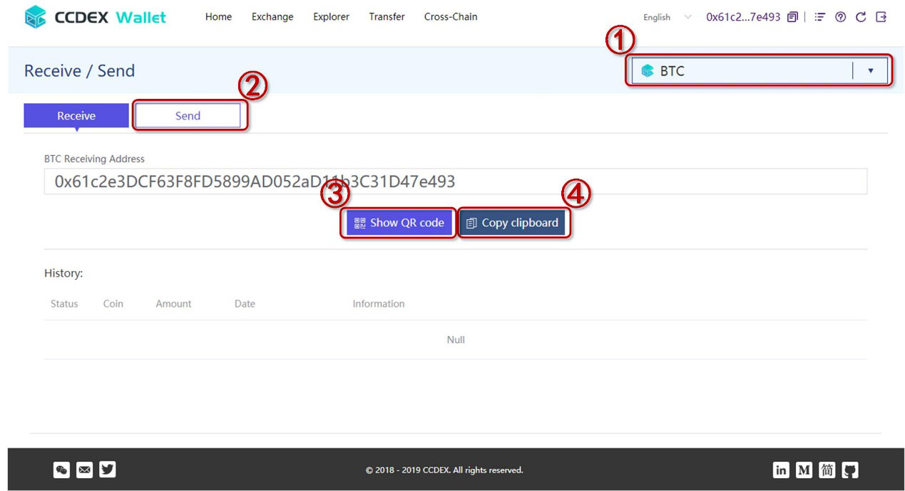
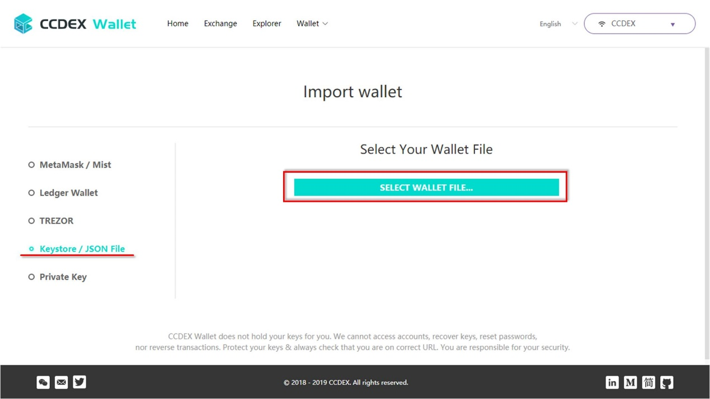
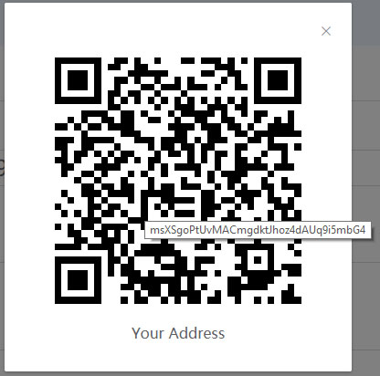
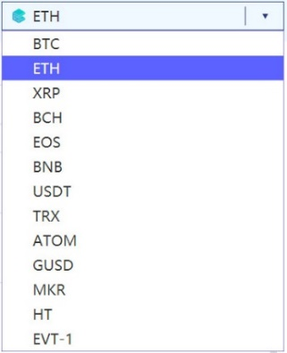

# 
CCDEX Cross-chain multi-asset wallet operation manual

# 1. Operation Interface

## 1.1. Home page

### 1.1.1. Components

###### .　　　　　　　　　　　　　　　　　　　　　　　　　　　　　　
*Figure* *1‑1*

The home page consists of three parts. As shown in *Figure 1-1*, they
are:

\[ 1 \].  Top menu bar.

\[ 2 \].  The operation area, used to create or log in to a wallet.

\[ 3 \].  Bottom menu bar.

### 1.1.2. Functions and Buttons

###### .　　　　　　　　　　　　　　　　　　　　　　　　　　　　　　
*Figure* *1‑2*

As shown in *Figure 1-2*, the buttons for the home page and their functions are as follows:

A.  \"Exchange\" menu. Used to jump to the Exchange page.

B.  \"Explorer\" menu. Used to jump to a block browser page.

C.  \"Wallet\" menu. Click it, there is a drop-down box that shows what the current operations can be done. As shown in *Figure 1-3*.

>　　　　　　　　　　　　　　　　　　　

###### .　　　　　　　　　　　　　　　　　　　　　　　　　　　　　　
*Figure* *1‑3*

> These two menus perform \"Create Wallet\" and \"Login Wallet\", respectively.

Multilingual switching button. At present, English and simplified Chinese are supported.

D.  \"Create Wallet\" button. Used to perform a wallet creation operation.

E.  \"Login Wallet\" button. Used for registered users to log in to their wallets.

F.  \"Contact\" area on the left. From left to right are WeChat, E-mail and Twitter.

G.  \"Contact\" area on the right. From left to right are LinkedIn, Medium, Jian Shu and GitHub.

## 1.2. "Login Wallet" page

### 1.2.1. Components

 
 

###### .　　　　　　　　　　　　　　　　　　　　　　　　　　　　　　
*Figure* *1‑4*

The "Login Wallet" page consists of three parts. As shown in *Figure
1-4*, they are:

\[ 1 \]. Top menu bar.

\[ 2 \]. Login options and operation areas.

\[ 3 \]. Bottom menu bar.

### 1.2.2. Functions and Buttons

 

###### .　　　　　　　　　　　　　　　　　　　　　　　　　　　　　　
*Figure* *1‑5*

As shown in *Figure 1-5*, the new buttons of the "Login Wallet" page and their functions are as follows:

A.  The menu of login options. Use to select the way you want to log in to your wallet.

B.  Operation button. Used to import the corresponding files according to different login methods.

## 1.3. "My Wallet" page

### 1.3.1. Components

###### .　　　　　　　　　　　　　　　　　　　　　　　　　　　　　　
*Figure* *1‑6*

The \"My Wallet\" page consists of three parts. As shown in *Figure 1-6*, they are:

\[ 1 \]. Top menu bar.

\[ 2 \]. Assets display and operation area.

\[ 3 \]. Bottom menu bar.

### 1.3.2. Functions and Buttons

###### .　　　　　　　　　　　　　　　　　　　　　　　　　　　　　　
*Figure* *1‑7*

As shown in *Figure 1-7*, the new buttons of the \"My Wallet\" page and its functions are as follows:

A.  \"Home\" menu. Used to return to the \"My Wallet\" page.

B.  \"Transfer\" menu. Used to jump to the intra-chain transfer operation page.

C.  \"Cross-Chain\" menu. Used to jump to the Cross-chain assets deposit/withdraw page.

D.  The address of the wallet you logged in. Click to copy the address to the clipboard.

E.  Function menu, from left to right are:

>  i. CCD Faucet. Used to get CCD token of CCDEX test net.

>  ii. \"Wallet backup\". Used to jump to the backup page for wallet Keystore or private key.

>  iii. \"Help\". Displays relevant help information.

>  iv. \"Refresh\". Used to refresh the current page.

>  v. \"Log out\". Used to exit the current login.

F.  \"Apply Cross-Chain\" button. Used to generate the address of all cross-chain assets in one click.

G.  Assets search box. Enter the abbreviation of the asset name in the input box, click on the query to complete the search for the asset.

H.  \"Send\" button. Click to jump to the intra-chain transfer page.

I.  \"Deposit\" and \"Withdraw\" buttons. The functions of deposit and withdrawing cross-chain assets. Click to jump to the \"Cross-Chain
Assets Deposit/Withdraw\" page.

## 1.4. "Intra-Chain Transfer" page

### 1.4.1. Components

###### .　　　　　　　　　　　　　　　　　　　　　　　　　　　　　　
*Figure* *1‑8*

The \"Intra-Chain Transfer\" page consists of four parts. As shown in *Figure 1-8*, they are:

\[ 1 \]. Top menu bar.

\[ 2 \]. Intra-Chain transfer operation area.

\[ 3 \]. Display area of transfer transaction history.

\[ 4 \]. Bottom menu bar.

### 1.4.2. Functions and Buttons

 

###### .　　　　　　　　　　　　　　　　　　　　　　　　　　　　　　
*Figure* *1‑9*

\"Intra-Chain Transfer\" page is divided into two operation interfaces: \"Receive\" and \"Send\".

As shown in *Figure 1-9*, the new buttons of the \"Receive\" interface and its functions are as follows:

A.  Asset switching drop-down box. Click in the drop-down box to select the asset you want to operate on.

B.  \"Send\" button. Used to switch to the interface of \"Send\".

C.  \"Show QR2 Code\" button. Click to display the QR code of your receiving address.

D.  \"Copy clipboard\" button. Click to copy the receiving address to the clipboard.

 

###### .　　　　　　　　　　　　　　　　　　　　　　　　　　　　　　
*Figure* *1‑10*

As shown in *Figure 1-10*, the new buttons of the \"Send\" interface and its functions are as follows:

A.  \"Receive\" button. Used to switch to the interface of \"Receive\".

B.  \"Advanced\" button. Click to display the advanced parameter setting interface of transfer transaction, as shown in *Figure 1-11*.

 

###### .　　　　　　　　　　　　　　　　　　　　　　　　　　　　　　
*Figure* *1‑11*

> You can set the parameters such as Nonce value, Gas Price and Gas Limit.
>
> If \"Advanced\" is not turned on, the transaction is set according to the default parameters.

C.  \"Send\" button. Click to send an intra-chain transfer transaction.

## 1.5. "Cross-Chain Assets Deposit/Withdraw" page

### 1.5.1. Components

 

###### .　　　　　　　　　　　　　　　　　　　　　　　　　　　　　　
*Figure* *1‑12*

The \" Cross-Chain Assets Deposit/Withdraw \" page consists of four parts. As shown in *Figure 1-12*, they are:

\[ 1 \]. Top menu bar.

\[ 2 \]. Cross-Chain assets deposit/withdraw operation area.

\[ 3 \]. The display area of deposit/withdraw transaction history.

\[ 4 \]. Bottom menu bar.

### 1.5.2. Functions and Buttons

 

###### .　　　　　　　　　　　　　　　　　　　　　　　　　　　　　　
*Figure* *1‑13*

\"Cross-Chain Assets Deposit/Withdraw\" page is divided into two operation interfaces: \"Deposit\" and \"Withdraw\".

As shown in *Figure 1-13*, the new buttons of the \"Deposit\" interface and its functions are as follows:

A.  Asset switching drop-down box. Click and select the asset you want to operate in the drop-down box.

B.  \"Withdraw\" button. Used to switch to the asset \"Withdraw\" interface.

C.  \"Show QR code\" button. Click to display the QR code of the deposit address of this cross-chain asset.

D.  \"Copy clipboard\" button. Click to copy the deposit address to the clipboard.

E.  \"Advanced\" button. As shown in *Figure 1-14*.

 

###### .　　　　　　　　　　　　　　　　　　　　　　　　　　　　　　
*Figure* *1‑14*

> Click to display the transaction hash input interface to manually submit cross-chain asset deposit confirmation by entering the known asset deposit transaction hash.

 

###### .　　　　　　　　　　　　　　　　　　　　　　　　　　　　　　
*Figure* *1‑15*

As shown in *Figure 1-15*, the new buttons of the \"Withdraw\" interface and its functions are as follows:

A.  \"Deposit\" button. Used to switch to the asset \"Deposit\" interface.

B.  \"Advanced\" button. Click to display the advanced parameter setting interface of transaction, as shown in *Figure 1-16*.

 

###### .　　　　　　　　　　　　　　　　　　　　　　　　　　　　　　
*Figure* *1‑16*

> You can set the parameters such as Nonce value, Gas Price and Gas Limit.
>
> If \"Advanced\" is not turned on, the transaction is set according to the default parameters.

3.  \"Withdraw\" button. Used to send the asset withdrawing transaction.

## 1.6. "Wallet Backup" page

### 1.6.1. Components

 

###### .　　　　　　　　　　　　　　　　　　　　　　　　　　　　　　
*Figure* *1‑17*

The \"Wallet Backup\" page consists of three parts. As shown in *Figure 1-17*, they are:

\[ 1 \]. Top menu bar.

\[ 2 \]. Backup operation area of Keystore and private key files

\[ 3 \]. Display area of Keystore and private key QR codes

\[ 4 \]. Bottom menu bar.

### 1.6.2. Functions and Buttons

 

###### .　　　　　　　　　　　　　　　　　　　　　　　　　　　　　　
*Figure* *1‑18*

As shown in *Figure 1-18*, the new buttons of the \"Wallet Backup\" page and its functions are as follows:

A.  \"Download\" button. Used to download the Keystore file corresponding to this address.

B.  Click to display private key.

C.  \"Copy clipboard\" button. Click to copy the private key to the clipboard.

D.  Click to display the QR code of private key.

# 2. Operation Guide

## 2.1. Create a new wallet

When users use CCDEX wallets, they need to create their own wallets firstly. Here are the steps for creating a new wallet.

Step 1, in the start page shown in *Figure 2-1*, click the \"Create Wallet\" button to enter the create wallet interface.

 

###### .　　　　　　　　　　　　　　　　　　　　　　　　　　　　　　
*Figure* *2‑1*

Step 2, the wallet creation interface is shown in *Figure 2-2*. Enter the password for the new wallet in a dialog box called \"Enter a 
password\".

Passwords consist of letters, numbers and special characters greater than or equal to 9 digits.

###### .　　　　　　　　　　　　　　　　　　　　　　　　　　　　　　
*Figure* *2‑2*

Step 3, click the "Next Step" button to generate a new wallet. As shown in *Figure 2-3*.

###### .　　　　　　　　　　　　　　　　　　　　　　　　　　　　　　
*Figure* *2‑3*

Step 4, after the wallet is generated, you will be prompted to save the Keystore.

**Notice:**

**This is important. Keystore and the password set in step 2 are the basis for users to log in to the wallet they created again.**

As shown in *Figure 2-4*.

 

###### .　　　　　　　　　　　　　　　　　　　　　　　　　　　　　　
*Figure* *2‑4*

After clicking the \"Download Keystore File (UTC / JSON)\" button, select the location and file name you want to save, click \"Save\" to complete the save of the Keystore file. As shown in *Figure 2-5*.

>　　　　　　

###### .　　　　　　　　　　　　　　　　　　　　　　　　　　　　　　
*Figure* *2‑5*

Step 5, please confirm that you have saved your Keystore, then click \"I understand. Continue. \" the button. As shown in *Figure 2-6*.

>　　　　　　　　　　　　　　　　　

###### .　　　　　　　　　　　　　　　　　　　　　　　　　　　　　　
*Figure* *2‑6*

The page jumps back to the start page. As shown in *Figure 2-7*.

 

###### .　　　　　　　　　　　　　　　　　　　　　　　　　　　　　　
*Figure* *2‑7*

Users can log in to the newly created wallet by clicking \"Login Wallet\". Now, the wallet creation is complete.

## 2.2. Login wallet

### 2.2.1. Login

Users can click the \"Login Wallet\" button on the Home page to enter the login wallet operation interface. As shown in *Figure 2-8*.

 

###### .　　　　　　　　　　　　　　　　　　　　　　　　　　　　　　
*Figure* *2‑8*

CCDEX supports a variety of wallet login methods.

 

###### .　　　　　　　　　　　　　　　　　　　　　　　　　　　　　　
*Figure* *2‑9*

As shown in the left menu in *Figure 2-9*, they are:

-   MetaMask / Mit

-   Ledger Wallet

-   TREZOR

-   Keystore / JSON File

-   Private Key

For the first time to log in to a new wallet, you need to use Keystore/JSON file. We take this as an example to introduce the process of wallet login.

Step 1, select the "Keystore/JSON File" item from the left menu. Click \"SELLECT WALLET FILE\...\" Button. As shown in *Figure 2-10*.

 

###### .　　　　　　　　　　　　　　　　　　　　　　　　　　　　　　
*Figure* *2‑10*

Step 2, select the location of the Keystore file where you want to log in to the wallet, enter the corresponding password, and click the \"Unlock\" button. As shown in *Figure 2-11*.

>　　　　　　　　　　　

###### .　　　　　　　　　　　　　　　　　　　　　　　　　　　　　　
*Figure* *2‑11*

Log in to the wallet successfully, then jumps to the \"My Wallet\" page. As shown in *Figure 2-12*.

 

###### .　　　　　　　　　　　　　　　　　　　　　　　　　　　　　　
*Figure* *2‑12*

Here you can see the balance of all the assets in the wallet and so on.

At this point, the login wallet operation is complete.

### 2.2.2. Get the \"Deposit/Withdraw\" address

In order to use the function of cross-chain assets management in your wallet, you need to generate Deposit/Withdraw addresses for all cross-chain assets in your wallet.

Step 1, click the \"Apply Cross-Chain" button on the top left of \"My Wallet\" page. As shown in *Figure 2-13*.

>　　　　　　　　　　　　　　　

###### .　　　　　　　　　　　　　　　　　　　　　　　　　　　　　　
*Figure* *2‑13*

Step 2, enter the password for the wallet and click the \"Unlock\" button. As shown in *Figure 2-14*.

 

###### .　　　　　　　　　　　　　　　　　　　　　　　　　　　　　　
*Figure* *2‑14*

Step 3, after seeing the \"success\" prompt at the bottom of the page, click the refresh button on the right side of the menu at the top of the page. As shown in *Figure 2-15*.

 

###### .　　　　　　　　　　　　　　　　　　　　　　　　　　　　　　
*Figure* *2‑15*

The \"Deposit/Withdraw\" appears in the \"Action\" column of all cross-chain assets in my wallet, indicating that the deposit and withdrawal address generation of cross-chain assets is complete. As shown in *Figure 2-16*.

 

###### .　　　　　　　　　　　　　　　　　　　　　　　　　　　　　　
*Figure* *2‑16*

## 2.3. Backup your wallet

After logging in to the wallet, the user can back up the Keystore file and private key of the wallet.

Step 1, enter the backup Wallet operation page by clicking the icon on the right side of the top menu. As shown in *Figure 2-17*.

>　　　　　　　　　　　　　　　　　　　　　　　　

###### .　　　　　　　　　　　　　　　　　　　　　　　　　　　　　　
*Figure* *2‑17*

Step 2, before backup wallet, you will be asked again to login of the wallet which you want to back up.

Consistent with the login operation, the user first chooses the way to log in the wallet. Here still take \"Keystore/JSON file\" as an example.

Select the Keystore file where you want to back up the wallet, enter the appropriate password, and then click the \"Unlock\" button. As shown in *Figure 2-18*.

 

###### .　　　　　　　　　　　　　　　　　　　　　　　　　　　　　　
*Figure* *2‑18*

When the wallet successfully logs in, the page will jump to the "Wallet Backup" page. As shown in *Figure 2-19*.

 

###### .　　　　　　　　　　　　　　　　　　　　　　　　　　　　　　
*Figure* *2‑19*

On this page, the Keystore file and private key of this wallet are displayed. You can save the Keystore file, or you can view and copy the private key, and view the corresponding QR code file.

The specific interface information and functional buttons are described in Chapter 1.6.

## 2.4. Intra-Chain transfer

Intra-Chain transfer refers to the transfer of assets, include CCDEX assets and assets issued on CCDEX, as well as cross-chain assets
supported by CCDEX, between two CCDEX accounts. The transfer transaction of all kinds of assets between CCDEX accounts is fast and efficient. The transfer process only occurs the CCDEX handling fee, the comprehensive rate is low.

### 2.4.1. Receive

Step 1, click the \"Transfer\" menu on the top menu to enter the \"Intra-Chain Transfer\" page. As shown in *Figure 2-20* and *Figure 2-21*.

###### .　　　　　　　　　　　　　　　　　　　　　　　　　　　　　　
*Figure* *2‑20*

 

###### .　　　　　　　　　　　　　　　　　　　　　　　　　　　　　　
*Figure* *2‑21*

The default is the asset \"Receive\" interface, which can be confirmed in blue through the \"Receive\" button. As shown in *Figure 2-22*.

>　　　　　　　　　　　　　　　　

###### .　　　　　　　　　　　　　　　　　　　　　　　　　　　　　　
*Figure* *2‑22*

Step 2, in the receiving address dialog box, there is the intra-chain transfer address of this wallet. As shown in *Figure 2-23*.

 

###### .　　　　　　　　　　　　　　　　　　　　　　　　　　　　　　
*Figure* *2‑23*

**Notice:**

**A. For intra-chain transfers, the receiving address of all assets is the same.**

**B. Simply hand over the address to other CCDEX wallet users and transfer money to the address by other users to complete the asset \"Receive\" operation of the intra-chain transfer.**

There are two ways to get the wallet\'s intra-chain transfer address. The first is to click the "Show QR code" button and display the QR code for the address. The address can be sent as a QR code to the user who wants to transfer money to you. As shown in *Figures 2-24* and *Figures 2-25*.

>　　　　　　　　　　　　　　　　　　　　

###### .　　　　　　　　　　　　　　　　　　　　　　　　　　　　　　
*Figure* *2‑24*

>　　　　　　　　　　　　　　　

###### .　　　　　　　　　　　　　　　　　　　　　　　　　　　　　　
*Figure* *2‑25*

The second way is to click the \"Copy clipboard\" button to copy the address to the system clipboard, as shown in *Figure 2-26*.

>　　　　　　　　　　　　　　　　　　　　　

###### .　　　　　　　　　　　　　　　　　　　　　　　　　　　　　　
*Figure* *2‑26*

Copy successfully, with a \"Copy Success\" prompt at the top of the page. As shown in *Figure 2-27*.

>　　　　　　　　　　　　　　　

###### .　　　　　　　　　　　　　　　　　　　　　　　　　　　　　　
*Figure* *2‑27*

Then send the copied address to the user who wants to transfer money to you through other means.

### 2.4.2. Send

Step 1, enter the \"asset sending\" interface of \"intra-chain transfer\".

There are several ways. First, on the \"My Wallet\" page, click the \"Send\" item after the corresponding asset to enter the \"Send\" interface of this asset. As shown in *Figure 2-28*.

 

###### .　　　　　　　　　　　　　　　　　　　　　　　　　　　　　　
*Figure* *2‑28*

The second way, in the "Receive" interface of "Transfer" page, click the\" Send \"button to enter the asset send interface. As shown in *Figure 2-29*.

>　　　　　　　　　　　　　　　　

###### .　　　　　　　　　　　　　　　　　　　　　　　　　　　　　　
*Figure* *2‑29*

In the asset send interface, you can switch the assets you need to operate through the asset selection drop-down box. As shown in *Figure 2-30*.

>　　　　　　　　　　　　　　　　

###### .　　　　　　　　　　　　　　　　　　　　　　　　　　　　　　
*Figure* *2‑30*

Step 2, fill in the transfer transaction information.

Enter the target address of the intra-chain transfer in \"Send Address\" and the amount of the transfer in \"Amount\". As shown in *Figure 2-31*.

 

###### .　　　　　　　　　　　　　　　　　　　　　　　　　　　　　　
*Figure* *2‑31*

**Notice:**

**A. When transferring asset in intra-chain, no matter what assets are sent, the target address of the transfer uses the address of the user on the CCDEX! YOU CANNOT USE THE DEPOSIT ADDRESS OF THE CORRESPONDING ASSET HERE.**

**B. The number of amount filled in should be less than the amount of account balance.**

**C. Intra-chain transfers require consumption of CCD as a fee, so you need to ensure that there is a sufficient balance of CCD in the user account.**

You can also activate the "Advanced" button to set the parameters of transaction fee. If not, the transaction is sent with default parameters. As shown in *Figure 2-32*.

 

###### .　　　　　　　　　　　　　　　　　　　　　　　　　　　　　　
*Figure* *2‑32*

Step 3, send the transaction.

Click the \"Send\" button and sending the intra-chain transfer transaction.

The password for the current wallet will be required to unlock. As shown in *Figure 2-33*.

 

###### .　　　　　　　　　　　　　　　　　　　　　　　　　　　　　　
*Figure* *2‑33*

Enter the correct password and click the \"Unlock\" button, and the transaction confirmation window will appear. As shown in *Figure 2-34*.

 

###### .　　　　　　　　　　　　　　　　　　　　　　　　　　　　　　
*Figure* *2‑34*

After checking the transaction information, click \"Yes, I am sure!\" Button, the transaction will be sent to the block chain.

Click \"No, get me out of here!\" to exit the current transaction.

Step 4, transaction success and historical transaction view.

A prompt for \"Success\" appears at the bottom of the page, indicating that the transaction was successful. As shown in *Figure 2-35*.

 

###### .　　　　　　　　　　　　　　　　　　　　　　　　　　　　　　
*Figure* *2‑35*

And you can see the relevant transactions in the \"History\". As shown in *Figure 2-36*.

 

###### .　　　　　　　　　　　　　　　　　　　　　　　　　　　　　　
*Figure* *2‑36*

Click the arrow on the far right of the transaction record to query for more detailed historical transaction information, as shown in *Figure 2-37*.

 

###### .　　　　　　　　　　　　　　　　　　　　　　　　　　　　　　
*Figure* *2‑37*

This information includes:

A.	The hash of this transaction on CCDEX. 

B.	The id of this transaction on CCDEX. 

C.	"From Address" of this transaction. 

Users can query the information and status of the transaction through the block browser (https://ccdex.top/explorer) according to the above information and the receiving address of the transaction (To Address).

In addition, you can view the changes in the account balance from \"My Wallet\".

## 2.5. Cross-Chain assets deposit/withdraw

Deposit of cross-chain asset refers to the operation of mapping assets from other block chains to CCDEX through DCCP cross-chain protocol, and then can trade and transfer with other kinds of assets on CCDEX.

Withdrawing of cross-chain asset extraction refers to the extraction of digital assets mapped on CCDEX to non-CCDEX accounts.

### 2.5.1. Deposit

We take cross-chain deposit BTC as an example.

Step 1, enter the cross-chain asset deposit interface.

Click the "Cross-Chain" menu on the top menu to enter the \"Cross-chain Asset Deposit/Withdraw\" page. As shown in *Figure 2-38* and *Figure 2-39*.

###### .　　　　　　　　　　　　　　　　　　　　　　　　　　　　　　
*Figure* *2‑38*

 

###### .　　　　　　　　　　　　　　　　　　　　　　　　　　　　　　
*Figure* *2‑39*

In addition, you can enter the \"Cross-Chain Asset Deposit/Withdraw\" interface of the corresponding digital asset through the \"My Wallet\" page, in the \"Action\" item of the asset list, click on the \"Deposit\" of the line of the asset you want to operate. As shown in *Figure 2-40*.

 

###### .　　　　　　　　　　　　　　　　　　　　　　　　　　　　　　
*Figure* *2‑40*

At this point, the default is the cross-chain asset \"Deposit\" interface, which can be confirmed by if the \"Deposit\" button is blue. As shown in *Figure 2-41*.

>　　　　　　　　　　　　　　　　

###### .　　　　　　　　　　　　　　　　　　　　　　　　　　　　　　
*Figure* *2‑41*

You can switch the assets you need to operate through the asset selection drop-down box, where we select BTC as the object of action. As shown in *Figure 2-42*.

>　　　　　　　　　　　　　　　　

###### .　　　　　　　　　　　　　　　　　　　　　　　　　　　　　　
*Figure* *2‑42*

**Notice:**

**The list of cross-chain assets contains only crypto-assets from external block chains supported by DCCP cross-chain protocol, not CCDEX and assets issued on CCDEX.**

Step 2, get the BTC deposit address and complete the deposit operation.

In the \"BTC Deposit Address\" dialog box, there is the BTC cross-chain asset deposit address. As shown in *Figure 2-43*.

 

###### .　　　　　　　　　　　　　　　　　　　　　　　　　　　　　　
*Figure* *2‑43*

**Notice:**

**The cross-chain asset deposit of BTC can be completed by simply transferring BTC to this address, or give this address to other users, who transfer BTC to the address.**

There are two ways to get BTC cross-chain asset deposit address. The first is to click the "Show QR code" button and display the QR code for this address. The address can be sent as a QR code to the user who wants to transfer BTC to you. As shown in *Figures 2-44* and *Figure 2-45*.

>　　　　　　　　　　　　　　　　　　　　

###### .　　　　　　　　　　　　　　　　　　　　　　　　　　　　　　
*Figure* *2‑44*

>　　　　　　　　　　　　　　　　

###### .　　　　　　　　　　　　　　　　　　　　　　　　　　　　　　
*Figure* *2‑45*

The second is to click the \"Copy clipboard\" button to copy the address to the system clipboard, as shown in Figure 2-46.

>　　　　　　　　　　　　　　　　　　　　　

###### .　　　　　　　　　　　　　　　　　　　　　　　　　　　　　　
*Figure* *2‑46*

Copy successfully, with a \"Copy Success\" prompt at the top of the page. As shown in *Figure 2-47*.

>　　　　　　　　　　　　　　　　

###### .　　　　　　　　　　　　　　　　　　　　　　　　　　　　　　
*Figure* *2‑47*

Then send the copied address to the user who wants to transfer money to you through other means.

### 2.5.2. Deposit Confirm

After the transaction is successful on the external block chain, the user is required to initiate the deposit confirmation and complete the asset mapping.

Step 1, get the external block chain transaction.

CCDEX wallets query for successful transactions by deposit addresses. The new transactions queried will be displayed in history. As shown in *Figure 2-48*.

 

###### .　　　　　　　　　　　　　　　　　　　　　　　　　　　　　　
*Figure* *2‑48*

Click on the \"\>\" symbol next to the transaction hash under \"Information\" to get more information about the deposit transaction. As shown in *Figure 2-49*.

###### .　　　　　　　　　　　　　　　　　　　　　　　　　　　　　　
*Figure* *2‑49*

In addition to automatic queries, users can enter the transaction hash that is known to be transferred to the deposit address successful in the \"Transaction Hash\" text box. The \"Transaction Hash\" text box will be displayed by activating the \"Advanced\" button.

Then click the \"Deposit\" button to manually initiate the entry request. As shown in *Figure 2-50*.

 

###### .　　　　　　　　　　　　　　　　　　　　　　　　　　　　　　
*Figure* *2‑50*

Step 2, confirm the transaction.

By clicking the \"Deposit\" button under \"Actions\" in \"History\" to submit the recharge transaction which you need to confirm. As shown in *Figure 2-51*.

>　　　　　　　　　　　　　　　　　　　　　　　

###### .　　　　　　　　　　　　　　　　　　　　　　　　　　　　　　
*Figure* *2‑51*

After submission, the user is asked to enter the current wallet password. Click the \"Unlock\" button. As shown in *Figure 2-52*.

 

###### .　　　　　　　　　　　　　　　　　　　　　　　　　　　　　　
*Figure* *2‑52*

Submit the confirmed cross-chain asset deposit transaction, verify and write to the block, complete the mapping of cross-chain assets. Tips for successful processing will be displayed at the bottom of the page. As shown in *Figure 2-53*.

 

###### .　　　　　　　　　　　　　　　　　　　　　　　　　　　　　　
*Figure* *2‑53*

At this time, click the \"Home\" menu in the top menu to return to the "My Wallet" page, and the new asset balance will be displayed in the corresponding assets. As shown in *Figure 2-54*.

>　　　　　　　　　　　　　　　　　

###### .　　　　　　　　　　　　　　　　　　　　　　　　　　　　　　
*Figure* *2‑54*

### 2.5.3. Withdraw

We take ETH as an example to introduce the operation of cross-chain asset withdrawal.

Step 1, switch to the Cross-chain Asset withdrawal interface.

There are several ways to switch to the cross-chain asset withdrawal interface. The first is to click the \"Withdraw\" button in the \"cross-chain asset deposit\" interface to complete the interface switching. As shown in *Figure 2-55*.

>　　　　　　　　　　　　　　　

###### .　　　　　　　　　　　　　　　　　　　　　　　　　　　　　　
*Figure* *2‑55*

In addition, on the \"My Wallet\" page, click the \"Withdraw\" option to the right of the corresponding asset, it will jump to the withdrawal interface of this asset too. As shown in *Figure 2-56*.

 

###### .　　　　　　　　　　　　　　　　　　　　　　　　　　　　　　
*Figure* *2‑56*

Through the asset drop-down box, you can select the digital assets you need to operate on. As shown in *Figure 2-57*.

>　　　　　　　　　　　　　　　　

###### .　　　　　　　　　　　　　　　　　　　　　　　　　　　　　　
*Figure* *2‑57*

Step 2, fill in the cross-chain asset withdrawal transaction.

Fill in the information of the asset withdrawal transaction, including the target address of the extraction and the amount extracted. As shown in *Figure 2-58*.

 

###### .　　　　　　　　　　　　　　　　　　　　　　　　　　　　　　
*Figure* *2‑58*

**Notice:**

**You need to reconfirm that the “Withdrawal Address” uses the correct address of the corresponding asset.**

**Cross-Chain asset withdrawal requires consumption of CCD and handling fees for target assets in external block chain transactions. Therefore, it is necessary to ensure that both the CCD and the extracted assets in the wallet have sufficient balances to cover the relevant handling fees.**

Advanced settings for transaction parameters are made by activating the \"Advanced\" option. As shown in *Figure 2-59*. If \"Advanced\" is not activated, the transaction will be set according to the default parameters.

 

###### .　　　　　　　　　　　　　　　　　　　　　　　　　　　　　　
*Figure* *2‑59*

Step 3, send a cross-chain asset extraction transaction.

After the transaction is completed, click the \"Withdraw\" button to send the cross-chain asset withdrawal transaction. As shown in *Figure 2-60*.

>　　　　　　　　　　　　　　　　　　

###### .　　　　　　　　　　　　　　　　　　　　　　　　　　　　　　
*Figure* *2‑60*

After submission, the user is asked to enter the password for the current wallet. And click the \"Unlock\" button. As shown in *Figure 2-61*.

 

###### .　　　　　　　　　　　　　　　　　　　　　　　　　　　　　　
*Figure* *2‑61*

Enter the correct password and click the \"Unlock\" button, and the transaction confirmation window will appear for the user to confirm. As shown in *Figure 2-62*.

###### .　　　　　　　　　　　　　　　　　　　　　　　　　　　　　　
*Figure* *2‑62*

After checking the transaction information, click \"Yes, I am sure!\" button, the transaction will be executed and sent to the block chain.

Click \"No, get me out of here!\" to exit the current transaction.

Step 4: transaction success and historical transaction view.

A prompt for \"Success\" appears at the bottom of the page, indicating that the transaction was successful. As shown in *Figure 2-63*.

 

###### .　　　　　　　　　　　　　　　　　　　　　　　　　　　　　　
*Figure* *2‑63*

And you can see the relevant transactions in the \"History\". As shown in Figure 2-64.

 

###### .　　　　　　　　　　　　　　　　　　　　　　　　　　　　　　
*Figure* *2‑64*

Click on the \"\>\" symbol on the far right of the transaction record to query for more detailed historical transaction information, as shown in *Figure 2-65*.

 

###### .　　　　　　　　　　　　　　　　　　　　　　　　　　　　　　
*Figure* *2‑65*

In addition, you can view the changes in the account balance from my wallet.

According to the sending address, the receiving address or the transaction hash, can also query the information and status of the transaction through the block browser (https://ccdex.top/explorer).

## 2.6.	Get CCD test token

There are two ways to get CCD test tokens. 

First way, access https://ccdex.top/faucet/. Fill in the account address of your CCDEX in the dialog box and click "Give me CCD" button. This address will receive 20 ccd test tokens. As shown in Figure 2-66.

###### .　　　　　　　　　　　　　　　　　　　　　　　　　　　　　　
*图 2‑66*

Second way, after logging in to your wallet, click on the icon of CCD faucet on the right function menu of the top menu on the "My Wallet" page. As shown in Figure 2-67.

>　　　　　　　　　　

###### .　　　　　　　　　　　　　　　　　　　　　　　　　　　　　　
*图 2‑67*

At this point, fill in the wallet address you logged in by default. Click "Give me CCD" button to get 20 CCD test tokens. As shown in Figure 2-68.

>　　　　　

###### .　　　　　　　　　　　　　　　　　　　　　　　　　　　　　　
*图 2‑68*

Every CCDEX account can get CCD test token one time. After obtaining, you can see the balance update by refreshing or re-logging in the "My Wallet" page.

# 3. Tools and other

## 3.1. Explorer of test net

The Explorer of CCDEX test net:
[[https://ccdex.top/explorer/]](https://ccdex.top/explorer/)

The Explorer of Bitcoin test net:
[[https://live.blockcypher.com/btc-testnet]](https://live.blockcypher.com/btc-testnet)

The Explorer of Ethereum Rinkeby test net:
[[https://rinkeby.etherscan.io/]](https://rinkeby.etherscan.io/)

## 3.2. Get the token of test net

Get CCD of CCDEX test net:
[[https://ccdex.top/faucet/]](https://ccdex.top/faucet/)

Get BTC of Bitcoin test net:
[[https://bitcoinfaucet.uo1.net/]](https://bitcoinfaucet.uo1.net/)

Get ETH of Ethereum Rinkeby test net:
[[https://faucet.rinkeby.io/]](https://faucet.rinkeby.io/)

## 3.3. Get the operation manual update

The latest wallet manual can be obtained from the following channels. 

A.	GitHub: [[https://github.com/ccdex/cc-wiki/blob/master/docs/default/Wallet_Manual_us_EN.md]](https://github.com/ccdex/cc-wiki/blob/master/docs/default/Wallet_Manual_us_EN.md)

B.	Document library on the CCDEX web site: [[https://ccdex.top/docs/en_US/]](https://ccdex.top/docs/en_US/)
